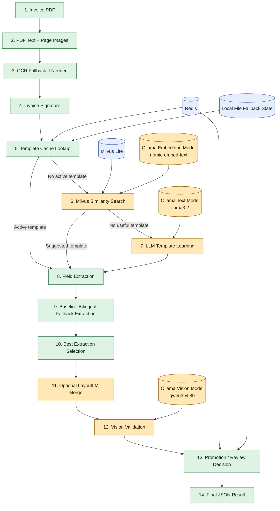
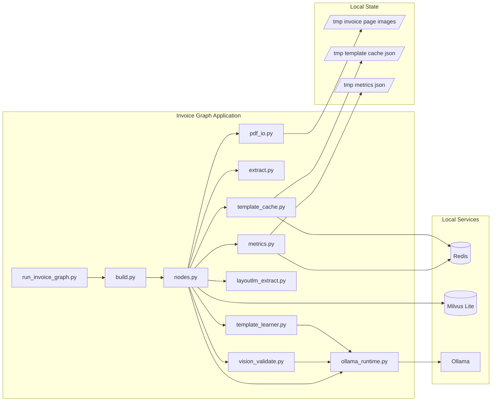
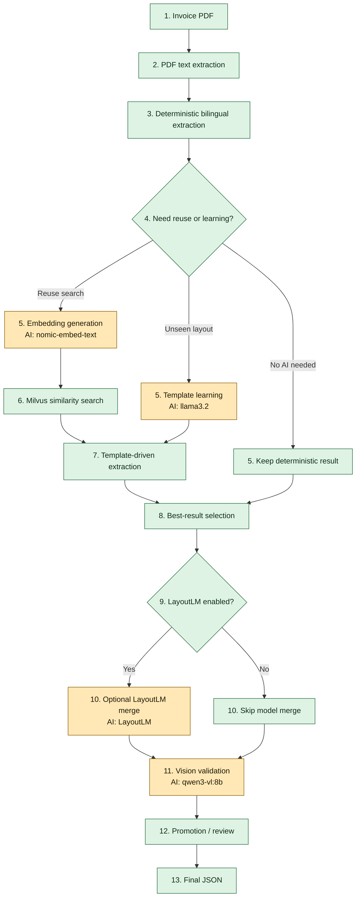
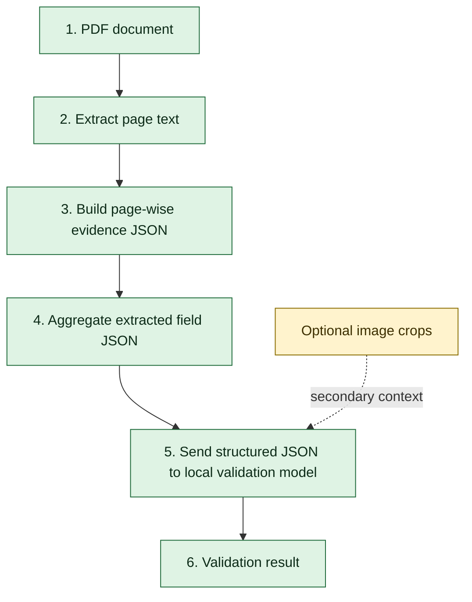
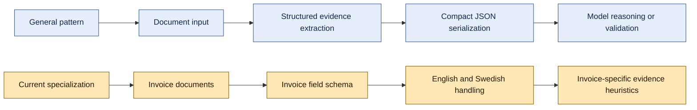

# Local Secure RAG Invoice Processing Design

## Overview

This system processes invoice PDFs fully on local infrastructure, extracts key invoice fields, validates the result, and reuses learned templates where possible.

The current implementation supports both English and Swedish invoice formats. It combines deterministic extraction, local vector similarity, local LLM-assisted template learning, and local vision validation.

The latest validation path is evidence-JSON-first: compact structured evidence derived from PDF text is sent to the model as the primary validation input, while images are optional fallback context.

## Goals

- Process invoices locally without cloud dependencies
- Support bilingual extraction for English and Swedish invoices
- Reuse prior template knowledge when layouts repeat
- Learn new extraction templates for unseen layouts
- Validate extracted values against invoice images using a local vision model
- Keep runtime state local and auditable
- Use GPU acceleration when supported by the local model runtime

## Non-Goals

- Cloud inference
- Broad multilingual support beyond current English and Swedish handling
- ERP integration
- Human review UI

## Inputs and Outputs

### Inputs

- Invoice PDF
- Rendered page images derived from the PDF

### Outputs

- Invoice signature
- Extracted fields
- Validation result
- Template source and promotion status

### Core Extracted Fields

- `invoice_no`
- `date`
- `subtotal`
- `tax`
- `total`
- `tax_rate`

## High-Level Architecture



## Runtime Component Diagram



## AI Model Responsibilities

| Pipeline task | File / function | Model | AI required | Purpose |
|---|---|---|---|---|
| Template learning | `src/invoice/template_learner.py` / `learn_regexes()` | `llama3.2` | Yes | Generates regex templates for unseen invoice layouts |
| Template refinement | `src/invoice/template_learner.py` / `refine_regexes()` | `llama3.2` | Yes | Refines regex templates after a failed extraction |
| Similarity embeddings | `src/graph_invoice/nodes.py` / `_milvus_embed()` | `nomic-embed-text` | Yes | Embeds signature and vendor text for Milvus similarity search |
| Vision validation | `src/invoice/vision_validate.py` / `validate_with_vision()` | `qwen3-vl:8b` | Yes | Validates extracted values against invoice page images |
| Optional layout extraction | `src/invoice/layoutlm_extract.py` / `extract_with_layoutlm()` | Configured `LayoutLM` model | Optional | Adds model-based extraction when enabled |

## Deterministic Responsibilities

These parts do not require AI models:

- PDF text extraction
- Page image rendering
- OCR fallback decision logic
- Invoice signature generation
- Template cache lookup
- Bilingual regex extraction
- Swedish and English fallback extraction
- Math consistency checks
- Template promotion logic
- Metrics recording
- Local JSON fallback state handling

## AI vs Deterministic Flow



## Main Modules

- [src/graph_invoice/run_invoice_graph.py](/home/dhanuka84/projects/local-secure-rag-invoice/src/graph_invoice/run_invoice_graph.py)
  Entry point. Runs the graph and prints the final JSON result plus backend metadata.

- [src/graph_invoice/build.py](/home/dhanuka84/projects/local-secure-rag-invoice/src/graph_invoice/build.py)
  Builds the LangGraph workflow and now emits per-node timing logs.

- [src/graph_invoice/nodes.py](/home/dhanuka84/projects/local-secure-rag-invoice/src/graph_invoice/nodes.py)
  Contains the pipeline nodes, extraction selection logic, similarity search, validation, and promotion flow.

- [src/invoice/pdf_io.py](/home/dhanuka84/projects/local-secure-rag-invoice/src/invoice/pdf_io.py)
  Extracts PDF text and renders page images into `/tmp`.

- [src/invoice/extract.py](/home/dhanuka84/projects/local-secure-rag-invoice/src/invoice/extract.py)
  Deterministic bilingual extractor. Supports English and Swedish fallbacks.

- [src/invoice/template_learner.py](/home/dhanuka84/projects/local-secure-rag-invoice/src/invoice/template_learner.py)
  Uses a local Ollama text model to learn or refine regex templates.

- [src/invoice/vision_validate.py](/home/dhanuka84/projects/local-secure-rag-invoice/src/invoice/vision_validate.py)
  Uses a local Ollama vision model to validate extracted fields against invoice images. Includes a configurable timeout.

- [src/invoice/layoutlm_extract.py](/home/dhanuka84/projects/local-secure-rag-invoice/src/invoice/layoutlm_extract.py)
  Optional GPU-aware LayoutLM path when a model is configured.

- [src/invoice/template_cache.py](/home/dhanuka84/projects/local-secure-rag-invoice/src/invoice/template_cache.py)
  Stores active and staging templates in Redis, with local JSON fallback.

- [src/invoice/metrics.py](/home/dhanuka84/projects/local-secure-rag-invoice/src/invoice/metrics.py)
  Stores success and promotion metrics in Redis, with local JSON fallback.

- [src/invoice/ollama_runtime.py](/home/dhanuka84/projects/local-secure-rag-invoice/src/invoice/ollama_runtime.py)
  Centralizes Ollama runtime detection, model configuration, and client construction.

## Processing Flow

### 1. PDF Extraction

`extract_pdf` reads the invoice PDF, extracts text, and renders page images.

### 2. OCR Fallback

`ocr_if_needed` runs OCR only if direct PDF text extraction is insufficient.

### 3. Signature Generation

`signature` builds a vendor/layout-derived signature used for cache reuse and similarity search.

### 4. Cache Lookup

`check_cache` attempts to find active or staging templates.

- Primary store: Redis
- Fallback store: local JSON files under `/tmp/local-secure-rag-invoice`

### 5. Similarity Search

`milvus_suggest` embeds the signature/vendor context and searches Milvus Lite for similar layouts.

- Embeddings use `nomic-embed-text` through Ollama
- If embedding or Milvus fails, the graph continues without similarity reuse

### 6. Template Learning

`learn_and_stage` uses `llama3.2` through Ollama to propose regex templates for unseen layouts.

### 7. Field Extraction

`extract_fields` runs two extraction strategies:

- template-driven extraction
- direct bilingual baseline extraction

The node now compares both and keeps the better result using:

- completeness of core fields
- math consistency: `subtotal + tax == total`

This prevents a bad reused template from overriding a correct bilingual fallback result.

### 8. Optional Hybrid Merge

`hybrid_extract_fields` can incorporate LayoutLM output when `LAYOUTLM_MODEL_ID` is configured. If not configured, it is skipped cleanly.

### 9. Vision Validation

`vision_validate` now primarily sends:

- extracted field JSON
- compact evidence JSON built from the PDF text

Optional images can still be sent as secondary context, but they are no longer the primary validation input by default.

This significantly reduces validation latency compared with full-image validation.

The validation layer now has:

- backend reporting
- configurable timeout via `INVOICE_VISION_TIMEOUT_SECONDS`
- deterministic pass override when fields are complete and mathematically consistent

### 10. Promotion or Review

The graph either:

- promotes the template
- leaves it in staging
- or marks it for review

Promotion is governed by:

- success metrics
- role checks
- optional Cerbos integration

## Storage Model

### Redis

Used for:

- template cache
- template staging
- metrics

### Local File Fallback

If Redis is unavailable, the system falls back to:

- `/tmp/local-secure-rag-invoice/template_cache.json`
- `/tmp/local-secure-rag-invoice/metrics.json`

### Milvus Lite

Used for:

- local vector similarity search

Default local writable path:

- `/tmp/local-secure-rag-invoice/milvus/milvus_lite.db`

## Model Usage

### Ollama Models

- Text model: `llama3.2`
- Embedding model: `nomic-embed-text`
- Vision model: `qwen3-vl:8b`
- Validation model: `llama3.2` by default for JSON-first validation

### GPU Behavior

- Ollama uses GPU automatically if local drivers/runtime support it
- LayoutLM uses CUDA if `torch.cuda.is_available()` is true
- The main GPU-backed path in current practice is Ollama inference

## Performance Observations

Observed timings from a real local run:

- `extract_pdf`: sub-second
- `check_cache`: near-zero when Redis is running
- `milvus_suggest`: sub-second
- `learn_and_stage`: around 10 seconds
- `vision_validate`: around 30 seconds to over 70 seconds depending on warm/cold state

Current main bottlenecks:

- vision model cold/warm latency
- LLM template learning on first-time layouts

Redis is not a major bottleneck once it is actually running.

## Measured Local Run

The following timings were measured from a successful local run with:

- Redis available
- Ollama available
- `nomic-embed-text` active for embeddings
- `qwen3-vl:8b` active for vision validation
- `INVOICE_VISION_TIMEOUT_SECONDS=120`

Command:

```bash
INVOICE_VISION_TIMEOUT_SECONDS=120 APP_ROLE=manager python -u -m src.graph_invoice.run_invoice_graph samples/invoices/invoice1.pdf
```

Observed node timings:

- `extract_pdf`: `0.171s`
- `ocr_if_needed`: `0.000s`
- `signature`: `0.000s`
- `check_cache`: `0.003s`
- `milvus_suggest`: `0.157s`
- `extract_fields`: `0.001s`
- `hybrid_extract_fields`: `0.000s`
- `vision_validate`: `45.097s`
- `promote_template`: `0.004s`
- `done`: `0.001s`

Observed result characteristics:

- `template_source`: `suggested`
- `field_extraction_backend`: `bilingual_fallback`
- `embedding_backend`: `ollama`
- `vision_backend`: `ollama`
- final extracted total remained correct: `107,50 kr`

This run confirms that the dominant cost in the end-to-end pipeline is the Ollama vision model call, not Redis or Milvus.

## JSON-First Validation Architecture

The validation flow has now shifted away from full-image-first reasoning.



This provides better latency and more controllable reasoning than sending large invoice page images alone.

Example conceptual evidence structure:

```json
{
  "top_lines": [
    "Fakturadatum: 2025-11-06",
    "OCR-/fakturanummer: 2687252805"
  ],
  "candidate_lines": [
    {
      "line": "Summa exkl moms 137,25 kr",
      "tags": ["subtotal"]
    },
    {
      "line": "Moms (25%) 34,32 kr",
      "tags": ["tax"]
    },
    {
      "line": "Totalt belopp 172,00 kr",
      "tags": ["total"]
    }
  ],
  "extracted_fields": {
    "subtotal": "137,25 kr",
    "tax": "34,32 kr",
    "total": "172,00 kr"
  }
}
```

## General Pattern vs Current Specialization

The evidence-JSON approach is general.



This means the architecture is generalizable, while the current implementation is invoice-specific.

Potential future reuse of the same pattern:

- receipts
- purchase orders
- forms
- bank statements
- utility bills

## Known Bottlenecks

### 1. Vision Validation Latency

The `qwen3-vl:8b` validation step is the single largest runtime cost.

Measured local examples:

- around `30s` when the timeout was set to 30 seconds and the model did not finish in time
- `45.097s` on a successful full completion
- over `70s` on an earlier cold-path run before timeout limits were added

Implication:

- first-time or cold-path local vision validation is the dominant source of latency

### 2. Template Learning Latency

When no reusable template is selected and the system enters `learn_and_stage`, the local text model can add around `10s`.

Implication:

- simple invoices that are already handled correctly by deterministic bilingual extraction may still pay unnecessary LLM latency

### 3. Optional Service Fallback Overhead

When Redis is unavailable, the system falls back to local files correctly, but repeated connection attempts can still add overhead.

This is significantly improved once Redis is actually available.

## Reliability Improvements Already Applied

- Page images render to `/tmp` instead of beside source PDFs
- Redis fallback no longer crashes the pipeline
- Metrics fallback no longer crashes the pipeline
- Suggested/bad templates can be overridden by stronger bilingual extraction
- Ollama runtime status is exposed in final JSON
- Per-node timing is printed during graph execution
- Vision validation can time out instead of hanging indefinitely

## Current Limitations

- `qwen3-vl:8b` is the slowest part of the pipeline
- LayoutLM is inactive unless explicitly configured
- Local file fallback is development-friendly but not ideal for multi-process coordination
- Template learning may be unnecessary for simple invoice layouts that already parse correctly via deterministic bilingual extraction

## Key Environment Variables

- `APP_ROLE`
- `OLLAMA_HOST`
- `INVOICE_TEMPLATE_LLM_MODEL`
- `INVOICE_VISION_MODEL`
- `INVOICE_EMBED_MODEL`
- `INVOICE_VISION_TIMEOUT_SECONDS`
- `INVOICE_REDIS_CONNECT_TIMEOUT_SECONDS`
- `INVOICE_MILVUS_URI`
- `LAYOUTLM_MODEL_ID`

## Verified Scenarios

### Offline bilingual extraction tests

Validated for:

- `samples/invoices/invoice1.pdf`
- `samples/invoices/godel.pdf`

Test file:

- [src/tools/test_bilingual_offline_extraction.py](/home/dhanuka84/projects/local-secure-rag-invoice/src/tools/test_bilingual_offline_extraction.py)

Run with:

```bash
python -m pytest -s src/tools/test_bilingual_offline_extraction.py
```

### Full graph execution

Run with:

```bash
APP_ROLE=manager python -u -m src.graph_invoice.run_invoice_graph samples/invoices/invoice1.pdf
```

## Recommended Next Steps

- Add a fast-path to skip template learning when bilingual extraction is already complete and mathematically consistent
- Add model warm-up for the first vision run
- Decide whether vision timeout should fail closed or remain advisory
- Add a dedicated integration test for Redis + Ollama + Milvus-enabled runs
